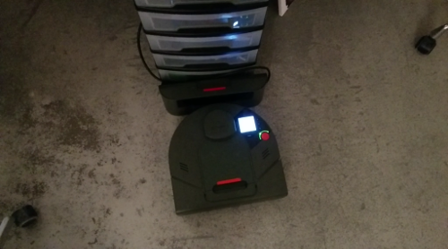
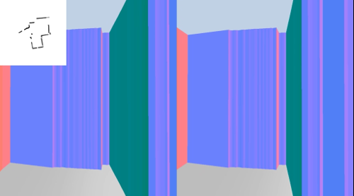
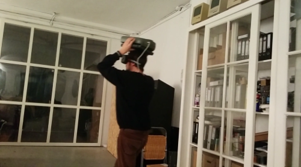

#Poor Man's Location Aware VR#

See [this video on Twitter](https://twitter.com/JaspervanLoenen/status/792113321000435713) for a short impression.

Simple demoscript to generate a 3d space for use with VR using a Neato vacuum robot. Run with `node mainapp.js` and open the webpage at `your-computers-ip-address:3000` on your phone. Tap to go fullscreen.

